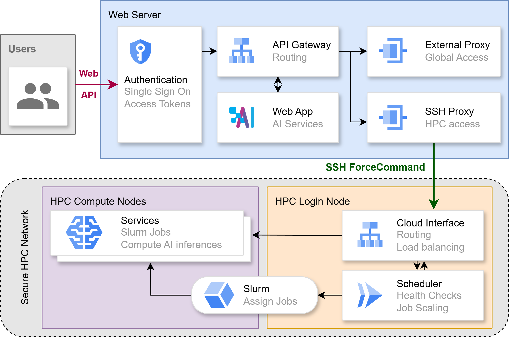
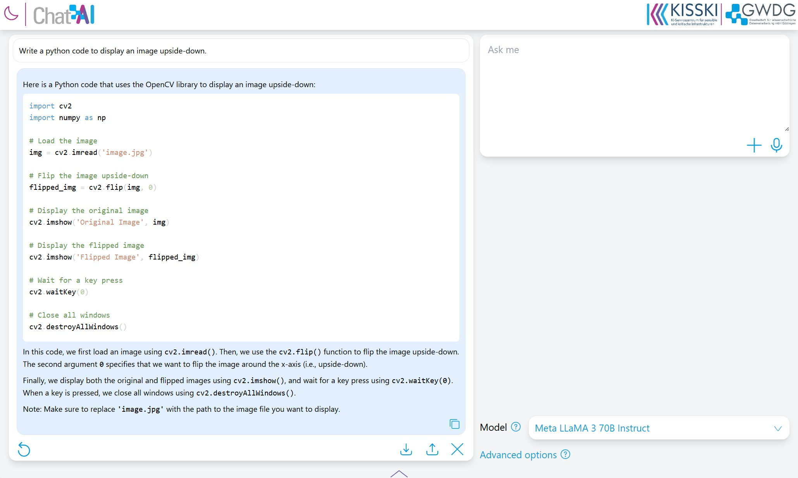

<p align="center">
  <picture>
    
  </picture>
</p>

<h3 align="center">
A Seamless Slurm-Native Solution for HPC-Based Services
</h3>

<p align="center">
<a href="https://docs.hpc.gwdg.de/services/chat-ai"><b>Documentation</b></a> | <a href="https://arxiv.org/abs/2407.00110"><b>Paper</b></a>
</p>

This repository contains the stand-alone web interface of Chat AI. The implementation of the remaining components of the complete architecture can be found in two other repos:
- Server components, incl. API gateway and SSH proxy: https://github.com/gwdg/saia-hub 
- HPC components, incl. scheduler and slurm scripts: https://github.com/gwdg/saia-hpc

<p align="center">

</p>

Together these repos provide the entire underyling mechanism for Chat AI, which can be generalized as a slurm-native HPC web service.

## Web interface

Note that the web interface provided in this repository can be set up on any device independently from the rest of the architecture, to act solely as a wrapper for an OpenAI-compatible API endpoint. 

<p align="center">

</p>

## Getting started

Make sure you have docker installed.

```bash
docker --version
```

Clone this repository and navigate to the root folder.

```bash
git clone https://github.com/gwdg/chat-ai
cd chat-ai
```

Build the docker images.

```bash
docker compose build chat-ai-front
docker compose build chat-ai-back
```

Start the web interface.

```bash
docker compose up front -d
docker compose up back -d
```

The `front` service is a ReactJS app which is served by ViteJS and runs entirely on the user browser. `back` is simply a wrapper for message requests which gives the developer more control over the requests and prevents CORS errors on the user browser.  

You should then be able to access the web interface via the specified port number.

-----
To apply any changes in the source code, run:
```bash
docker compose up restart front
docker compose up restart back
```

Note that in some cases rebuilding the image might be necessary.

## Configuration

You can set the port numbers for both the `front` and `back` services in the `docker-compose.yml` file. The path to the `back` must be set via a reverse-proxy or virtual-host 

The `front` interacts with the following endpoints to function properly:
- Getting the model list by `/chat-ai/models`, defined in `/front/src/apis/ModelList.jsx`
- Communicate with the `back` service by `/chat-ai-backend`, defined in `/front/src/apis/Completion.jsx`.

The `back` interacts with the Kong API gateway to route requests into the HPC services or alternatively connects to an OpenAI-compatible service endpoint. This can be configured in `/back/service.js`.

To connect the front to the back service, a route such as `/chat-ai-backend` must be created to its port number, or alternatively, the paths can be changed in the aforementioned source files. The route specified in `ModelList.jsx` must return a OpenAI-style JSON response containing the model ids and names, which will be displayed in the dropdown menu in the interface. 

## Acknowledgements
We thank Priyeshkumar Chikhaliya <p.chikhaliya@stud.uni-goettingen.de> for the design and implementation of the web interface and all colleagues and partners involved in this project.

## Citation

If you use Chat AI in your research or services, please cite us as follows:

```
@misc{doosthosseini2024chataiseamlessslurmnative,
      title={Chat AI: A Seamless Slurm-Native Solution for HPC-Based Services}, 
      author={Ali Doosthosseini and Jonathan Decker and Hendrik Nolte and Julian M. Kunkel},
      year={2024},
      eprint={2407.00110},
      archivePrefix={arXiv},
      primaryClass={cs.DC},
      url={https://arxiv.org/abs/2407.00110}, 
}
```