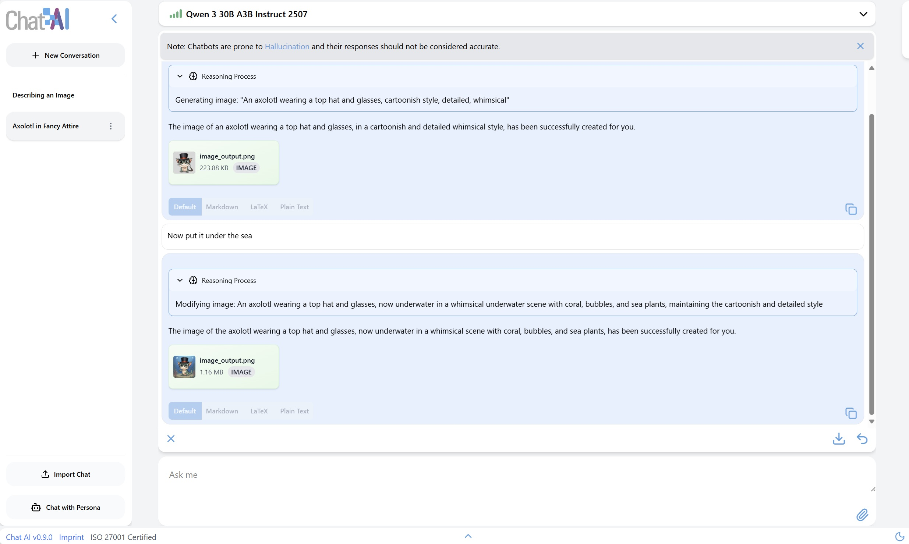

<p align="center">
  <picture>
    
  </picture>
</p>

<h3 align="center">
A Seamless Slurm-Native Solution for HPC-Based Services
</h3>

<p align="center">
<a href="https://docs.hpc.gwdg.de/services/chat-ai"><b>Documentation</b></a> | <a href="https://www.researchsquare.com/article/rs-6648693/v1"><b>Paper</b></a>
</p>

This repository contains the stand-alone web interface of Chat AI. The implementation of the remaining components of the complete architecture can be found in two other repos:
- Server components, incl. API gateway and SSH proxy: https://github.com/gwdg/saia-hub 
- HPC components, incl. scheduler and slurm scripts: https://github.com/gwdg/saia-hpc

<p align="center">

</p>

Together these repos provide the entire underyling mechanism for Chat AI, which can be generalized as a slurm-native HPC web service.

<p align="center">

</p>

## Quick Installation Guide

Note that Chat AI's web interface provided in this repository can be set up on any device independently from the rest of the architecture, to act solely as a wrapper for an OpenAI-compatible API endpoint.

1. Ensure that Docker is installed. Follow the [guides](https://docs.docker.com/engine/install/) to install Docker on your operating system. 
    ```bash
    docker --version
    ```

2. Clone this repository and navigate to the root folder.
    ```bash
    git clone https://github.com/gwdg/chat-ai
    cd chat-ai
    ```

3. In the `secrets` directory, rename `front.json.sample` to `front.json` and `back.json.sample` to `back.json`, and configure them accordingly. For a local installation with a valid Chat AI API key, you only need to replace the value of `apiKey` in `back.json`:
    ```bash
    {
      "port": 8081,
      "apiEndpoint": "https://chat-ai.academiccloud.de/v1",
      "apiKey": "<your_chat_ai_api_key>",
      "serviceName": "Custom Chat AI"
    }
    ```

4. Run the components using `docker-compose`:
    ```bash
    docker compose up
    ```

5. Open your browser and navigate to `http://localhost:8080/`, or whichever path and port number you have configured.

## Getting Started

The web interface consists of two Docker containers, `front` and `back`. The `front` service is a ReactJS app served by ViteJS and runs entirely on the client's browser. The `back` service is simply a wrapper for message requests which gives the developer more control over the requests and prevents CORS errors on the user's browser.  

Make sure you have docker installed and docker compose.

For Ubuntu 24.04, install docker compose with:
```bash
aptitude install docker-compose-v2
```

To build the images, run:

```bash
docker compose build front
docker compose build back
```

To start either of the two components, run:
```bash
docker compose up front -d
docker compose up back -d
```

You should then be able to access the web interface via the path and port number specified in the config file.

-----
To apply any changes in the configuration and/or source code, run:
```bash
docker compose restart front
docker compose restart back
```

Note that in some cases rebuilding the docker image might be necessary.

## Configuration

You can set the port numbers for both the `front` and `back` services in the `front.json` and `back.json` files.

The `front` service uses the following configurable attributes in `front.json`:
- `mode`: Set to `dev` to enable development environment and `prod` for production.
- `port`: Port number to listen on. Default: 8080
- `backendPath`: Path to `back` service, used for sending messages and processing PDF files, e.g. `http://localhost:8081/` or `/backend`
- `modelsPath`: Path to get list of available models from. Simply set to `<backendPath>/models` if unsure
- `userDataPath`: (Optional) Path to get user data. Simply set to `<backendPath>/user` if unsure
- `defaultSettings`: Default settings for new conversations, including default `model`, `modelName`, `top_p`, and `temperature`. This default model will also be used for title generation and memory updates.

The `back` service listens to requests from `front` and interacts with an OpenAI-compatible API endpoint to produce responses. It uses the following configurable attributes in `back.json`:
- `port`: Port number to listen on. Default: 8081
- `apiEndpoint`: Endpoint of your API provider. If you have a Chat AI API key, set this to `https://chat-ai.academiccloud.de/v1`
- `apiKey`: Your valid API key
- `serviceName`: (Optional) A custom service name to be sent as a header in API requests to your provider. Will not be visible in the interface

If you wish to avoid using different ports for the `front` and `back` services, you must set up a reverse proxy or virtual host to route paths such as `/models` and `/backend` to the backend service listening on its own distinguished port. This can be done with popular server software such as Apache or Nginx.

Also, if you wish to customize the list of available models, you must create a path that returns an OpenAI-style JSON response containing the model ids and names, and set the `modelsPath` in `front.json` accordingly. If configured correctly, your custom list will be displayed in the dropdown menu in the interface instead of what you get from your API provider.

## Acknowledgements
We thank Priyeshkumar Chikhaliya <p.chikhaliya@stud.uni-goettingen.de> for the design and implementation of the web interface.

We thank all colleagues and partners involved in this project.

## Citation

If you use Chat AI in your research or services, please cite us as follows:

```
@misc{doosthosseiniSAIASeamlessSlurmNative2025,
  title = {{{SAIA}}: {{A Seamless Slurm-Native Solution}} for {{HPC-Based Services}}},
  shorttitle = {{{SAIA}}},
  author = {Doosthosseini, Ali and Decker, Jonathan and Nolte, Hendrik and Kunkel, Julian},
  year = {2025},
  month = jul,
  publisher = {Research Square},
  issn = {2693-5015},
  doi = {10.21203/rs.3.rs-6648693/v1},
  url = {https://www.researchsquare.com/article/rs-6648693/v1},
  urldate = {2025-07-29},
  archiveprefix = {Research Square}
}
```
